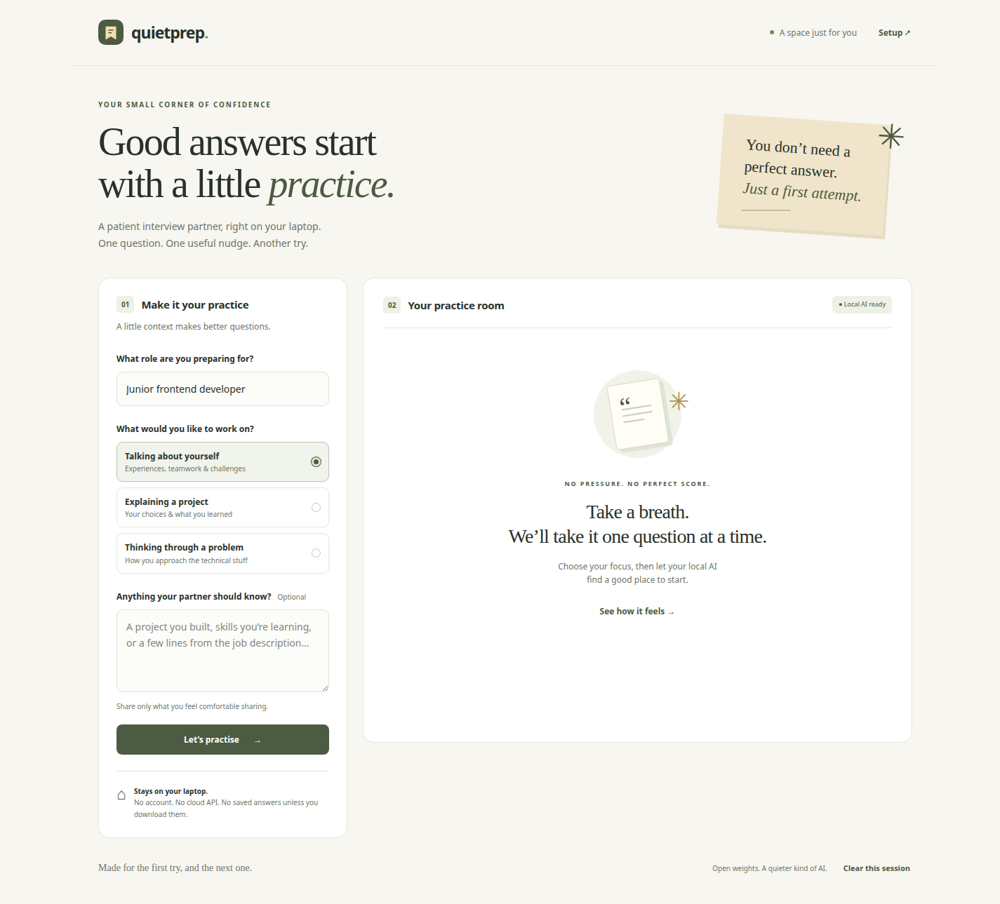

# QuietPrep

QuietPrep is a private interview practice partner for someone preparing for an early-career job. Choose a role, answer one question, and get a specific strength, one improvement, and a prompt for another attempt. Qwen2.5 runs locally; practising needs no cloud API, account, or internet after setup.

Built starting 3 October 2026 for the [Hacktoberfest Build for a Friend challenge](https://dev.to/challenges/hacktoberfest-weekend-2026-10-01). The real beneficiary and their feedback are still to be supplied by the project owner. This repository does not claim a completed challenge submission or a prize.

[Watch the live local AI demo](docs/media/quietprep-demo.mp4). It uses synthetic data and shows a generated question, feedback, a retry, and a notes export.



## Run on Linux

Requires Linux x86_64, Python 3.11+, approximately 2 GB of disk space for setup, and enough free RAM for a 1.5B model (allow about 3 GB). A GPU is optional; the supplied runner uses the CPU. The app itself has no Python or npm dependencies.

```bash
python3 scripts/setup_local.py
python3 scripts/run_local.py
```

Open **http://127.0.0.1:8767**. Ctrl-C stops the model and app.

Setup downloads a pinned llama.cpp CPU runtime and the official Qwen2.5-1.5B-Instruct Q4_K_M model, verifies both SHA-256 checksums, and keeps them inside `.runtime/`. It does not install anything globally. The model download is approximately 1.12 GB. Downloads require internet; inference does not.

The Linux archive may require a recent glibc. If it cannot start on your distribution, use the Ollama option below. Model startup diagnostics are in `.runtime/model.log`; the bundled runner reduces logging verbosity and does not enable prompt logging.

## Run with Ollama on other platforms

Install [Ollama](https://ollama.com/download) using its official instructions, then:

```bash
ollama pull qwen2.5:1.5b
ollama serve
```

If Ollama is already running, skip `ollama serve`. In another terminal:

```bash
python3 server.py
```

The default backend is Ollama at `http://127.0.0.1:11434`. To change the local model, set `QUIETPREP_MODEL` before starting the server. Model URLs must use a loopback IP; remote or cloud backends are rejected.

On Linux/macOS:

```bash
QUIETPREP_MODEL=qwen2.5:7b python3 server.py
```

On PowerShell:

```powershell
$env:QUIETPREP_MODEL = "qwen2.5:7b"
python server.py
```

Pull the selected model first. Larger models need more RAM and can be slower. The bundled 1.5B model was chosen so a laptop can run the demo.

## Practise

1. Enter your target role and choose behavioral, project, or technical practice. Context is optional.
2. Select **Let’s practise** and answer the generated question.
3. Select **Give me a nudge** to get feedback. Quotes are checked against your actual answer.
4. Select **Try my answer again** to keep and edit your answer. Previous attempts remain in memory and appear in downloaded notes.
5. Download notes if you want to keep them, or clear the session to remove the app’s copy of your answers and context.

**See how it feels** is a clearly marked, fixed walkthrough. Its sample feedback is not model-generated. Start a live practice session for feedback on your own answer.

## Privacy and limits

The browser sends text only to the local QuietPrep server, which calls a loopback model endpoint. Outbound inference requests bypass environment proxies and refuse redirects. The app uses no external fonts, scripts, analytics, database, browser storage, or automatic answer files. It binds to `127.0.0.1` and rejects cross-site POSTs and untrusted Host headers.

Your answer and previous attempts live in the browser’s memory until you clear the session or close the page. The model process also holds recent inference context in RAM. Closing the model releases that process memory; clearing the UI does not forcibly wipe model or operating-system memory. An explicit download saves notes to your chosen download folder. External model runtimes such as Ollama have their own settings; consult their logging documentation.

Small models can be generic or wrong. The quote check establishes that a quoted passage exists in your answer; it does not prove the coaching is correct. QuietPrep is a communication practice tool, not a hiring score or technical grading system. Verify technical advice. No model has access to files, tools, or external sites through this app.

## Verify

```bash
python3 -m unittest discover -s tests -v
node --check public/app.js
```

The tests cover invalid requests, local endpoint restrictions, cross-site access, invented quotes, malformed model responses, request limits, and concurrent inference. They do not require a downloaded model.

For the browser test, run QuietPrep, then start Chrome with a separate profile and DevTools port:

```bash
google-chrome --headless=new --disable-gpu --no-first-run \
  --user-data-dir=/tmp/quietprep-browser \
  --remote-debugging-address=127.0.0.1 --remote-debugging-port=9225 about:blank
```

In another terminal, using Node 22+:

```bash
node scripts/browser_check.mjs
```

This checks real inference, quote grounding, retry, example labeling, session clearing, the setup dialog, and mobile overflow. It saves screenshots and a synthetic sample response under `artifacts/`, which is excluded from Git. Do not replace the synthetic test data with personal information if you plan to share the artifacts.

## Open components and licenses

- This app: MIT, see [LICENSE](LICENSE).
- [Qwen2.5-1.5B-Instruct](https://huggingface.co/Qwen/Qwen2.5-1.5B-Instruct): Apache 2.0. Official [GGUF weights](https://huggingface.co/Qwen/Qwen2.5-1.5B-Instruct-GGUF), revision `91cad51170dc346986eccefdc2dd33a9da36ead9`.
- [llama.cpp](https://github.com/ggml-org/llama.cpp): MIT, pinned runtime `b11146`.
- Optional [Ollama](https://github.com/ollama/ollama): MIT.

The setup script downloads these components separately; their licenses remain applicable. The app implementation and writing were prepared with Codex assistance. No claims of beneficiary interviews, user testimonials, or contest success were generated.
